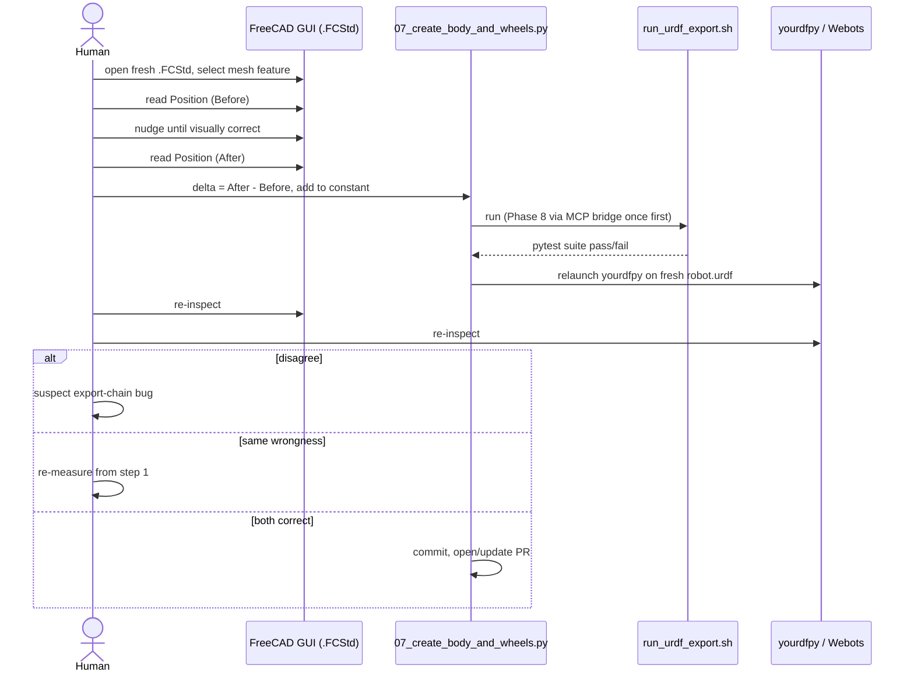

# Inverted Pendulum Project

Simulation and numerical modeling of inverted pendulum dynamics with FreeCAD integration.

## Features

- **Numerical Simulation:** Compute pendulum dynamics using numpy/scipy
- **Visualization:** Plot results with matplotlib
- **Parametric CAD:** Generate brackets/parts with CadQuery, validate/repair meshes with trimesh
- **FreeCAD Integration:** Convert/export models via headless FreeCAD, invoked as a subprocess

## Setup

### Mamba environment (single env: `pendulum-tools`)

All numeric/CAD-authoring work (simulation, servo positioning, assembly linking,
CadQuery bracket generation, trimesh mesh processing) uses one mamba environment.
FreeCAD itself is never installed into or imported from this environment — it is
always invoked externally as a separate subprocess (see below), because FreeCAD
and CadQuery/OCP bundle different, incompatible OpenCASCADE builds.

```bash
# Create the environment (see mamba-envs.yaml for the full spec)
mamba create -n pendulum-tools -c conda-forge python=3.11 \
  cadquery trimesh numpy scipy matplotlib -y

# Activate
mamba activate pendulum-tools

# Verify
python -c "import cadquery, trimesh, numpy, scipy, matplotlib; print('OK')"
```

**Reproducible install:** `mamba-envs.yaml` is a recipe (unpinned minimum versions). For an
exact, reproducible environment matching what this project was tested against, use the
pinned lock file instead:

```bash
mamba env create -n pendulum-tools -f mamba-envs.lock.yml
```

Regenerate it after any env change with:
```bash
mamba env export --no-builds -n pendulum-tools > mamba-envs.lock.yml
```

## Usage

### Run Simulation

**Not yet implemented.** `simulate.py` (numpy/scipy pendulum dynamics) is planned but
does not exist in this repo yet — see the CAD/mesh tooling below for what's currently
implemented (Phases 1-6).

### FreeCAD Integration (headless subprocess)

FreeCAD is invoked headlessly via `freecadcmd`, in a separate process from any
CadQuery/trimesh code — never imported into the same Python process.

**Binary selection:** set the `FREECAD_BIN` environment variable to point at a
specific FreeCAD build. Defaults to `freecadcmd` (relies on PATH) if unset.

```bash
# Default: use freecadcmd from PATH
python3 freecad_integration_example.py direct

# Or pin to a specific FreeCAD build (e.g. the 1.1.3 AppImage extraction,
# available via the shorter ~/.local/bin/freecadcmd1.1 symlink)
export FREECAD_BIN=~/.local/bin/freecadcmd1.1
"$FREECAD_BIN" -c "
exec(open('freecad_integration_example.py').read())
use_freecad_direct()
"
```

**Benefits of the direct/subprocess pattern:**
- No network layer, no bridge process to keep running
- Full FreeCAD Python API available (Part, Mesh, App, …)
- FreeCAD process boundary keeps its OpenCASCADE build isolated from OCP/CadQuery

**Human/agent review only:** this project's shipped scripts stay headless-only, but a generator
script can be run once through the separate live FreeCAD MCP bridge (not part of this project's
pipeline) to produce a `.FCStd` with visibility + camera framing actually baked in for visual
review — see root `CLAUDE.md`'s "FreeCAD Live Bridge" section for the exact invocation and known
caveats (dimensional checks read slightly off under a live GUI; validate headlessly instead).
The same bridge also doubles as a design-iteration tool: a human transforms objects live, values
get checked for real collisions, then get ported into the generator script as named constants
(see Issue #9's Stage 1 redesign in `DESIGN.md` for a worked example).

### Phase 1: Convert servo STL to STEP

```bash
# Uses FREECAD_BIN if set, otherwise falls back to "freecadcmd" on PATH
FREECAD_BIN=~/.local/bin/freecadcmd1.1 \
  mamba run -n pendulum-tools python3 03_Parts/Generators/01_convert_servo_stl_to_step.py
```

### Phase 6: Parametric CAD generation & mesh tooling (CadQuery/trimesh)

Runs directly in the `pendulum-tools` mamba env's own Python (never mixed with FreeCAD):

```bash
mamba run -n pendulum-tools python 03_Parts/Generators/06_cadquery_parametric_brackets.py --help
mamba run -n pendulum-tools python 03_Parts/Generators/test_06_phase6_tooling.py
```

See `03_Parts/Generators/README.md` and `03_Parts/Generators/README_PHASE6.md` for details.

### Phases 7-11: Complete URDF Export Pipeline (Robot Assembly + Simulation)

Generate the complete URDF robot model in one command:

```bash
cd 03_Parts/Generators
./run_urdf_export.sh
```

This runs all phases (7-11) end-to-end, producing:
- `robot_assembly.FCStd` (FreeCAD model with joints)
- `06_Exports/urdf/robot.urdf` (URDF for simulators like Webots, Gazebo)
- `06_Exports/urdf/meshes/` (visual mesh assets)
- `11_inertia_validation_report.json` (hardware validation data)

See `03_Parts/Generators/README.md` for detailed phase-by-phase documentation.

### Manual Visual-Alignment Correction Workflow (FCStd → URDF)

Automated collision checks aren't a reliable gate for visual misalignment here — a
human measuring real positions and re-checking the render is. Loop:

1. Open a **fresh** `.FCStd` (never a stale session) and select the exact mesh
   feature to fix (e.g. `feetech_STS3032_collision_proxy[_Right]`), not a parent
   `App::Part` container.
2. Read **Data tab → Placement → Position** (absolute X/Y/Z) — *Before*. Don't
   use the Transform dialog's Translation (U/V/W): it's an incremental delta
   that resets on reopen and has a Global/local toggle that's easy to
   misconfigure.
3. Nudge the object until visually correct, read Position again — *After*.
   `delta = After − Before`, added to the matching constant in
   `07_create_body_and_wheels.py`.
4. Regenerate (`./run_urdf_export.sh` — Phase 8 needs the live MCP bridge once
   first) and run the full test suite.
5. Re-check both the `.FCStd` and a fresh `yourdfpy` render. Same wrongness in
   both → re-measure from step 1. Disagreement between them → suspect the
   export chain instead.



### Export Simulation Results to FreeCAD

```python
from freecad_integration_example import export_simulation_to_freecad
import numpy as np

# Run simulation
# positions = run_simulation(duration=10)

# Visualize in FreeCAD
# export_simulation_to_freecad(positions, "pendulum_trajectory.step")
```

## Dependencies

- `numpy` — numerical computing
- `scipy` — scientific algorithms
- `matplotlib` — data visualization
- `cadquery` — parametric CAD generation (Phase 6)
- `trimesh` — mesh processing and repair (Phase 6)
- FreeCAD (external, not a Python dependency) — invoked headlessly via subprocess (`FREECAD_BIN`)

## Project Structure

```
inverted-pendulum-project/
├── mamba-envs.yaml                     # Single pendulum-tools mamba env spec (recipe)
├── mamba-envs.lock.yml                 # Pinned, reproducible env export
├── README.md                           # This file
├── freecad_integration_example.py      # FreeCAD integration example (direct/subprocess)
├── simulate.py                         # (planned, not yet implemented) Pendulum simulation
├── 01_Documentation/
│   └── MCP_TOOLS_REFERENCE.md         # Deprecated MCP tool catalog (see note in file)
├── 02_Design_Inputs/                  # Design specifications & parameters
│   ├── robot_parameters.yaml           # Robot dimensions/masses (used by Phases 7-11)
│   ├── prototype_measurements.schema.json  # (optional) Hardware measurement schema
│   └── prototype_measurements.example.json # (optional) Example measurement data
├── 03_Parts/                          # FreeCAD part files (.FCStd, .step)
│   ├── Mechanical/                    # Servo STEP/STL assets (Phases 1-4)
│   └── Generators/                    # Phase 1-11 generator scripts (see README.md in this dir)
├── 04_Assemblies/                     # Assembly definitions
├── 05_Drafts_Context/                 # Preliminary designs & concepts
└── 06_Exports/                        # Generated exports
    └── urdf/                          # URDF robot model + meshes (Phase 10)
        ├── robot.urdf                 # URDF robot model (robot description format)
        └── meshes/                    # Visual mesh assets for URDF
```

## Architecture note: FreeCAD vs CadQuery/OCP process boundary

FreeCAD and CadQuery/OCP must never be imported in the same Python process:
FreeCAD bundles its own OpenCASCADE build, and OCP (used by CadQuery) bundles a
different one — mixing them risks ABI/symbol conflicts. This project keeps them
as separate subprocess invocations:

- FreeCAD-only scripts run via `freecadcmd` as a subprocess (`FREECAD_BIN`).
- CadQuery/trimesh scripts run directly in the `pendulum-tools` mamba env's own Python.

## References

- [FreeCAD](https://www.freecadweb.org/)
- [CadQuery](https://cadquery.readthedocs.io/)
- [Trimesh](https://trimesh.org/)
- [NumPy/SciPy Documentation](https://scipy.org/)

## See Also

- `../CLAUDE.md` — Complete development guide
